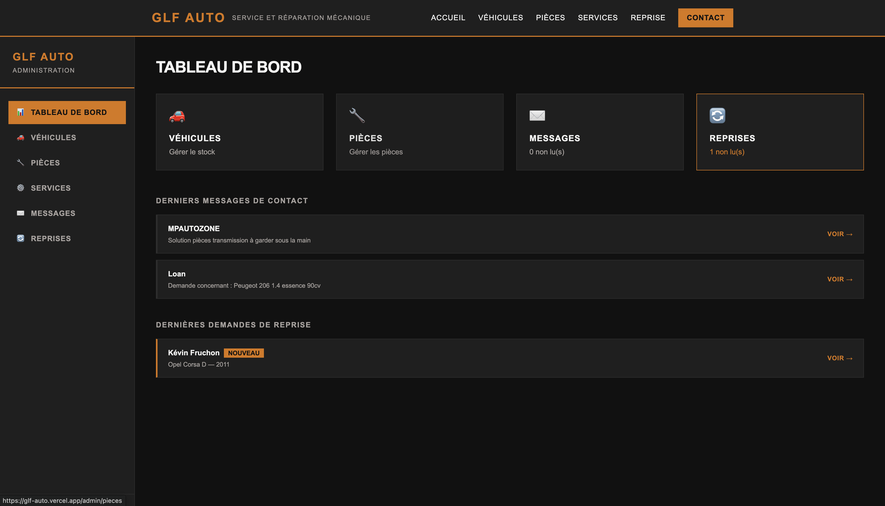
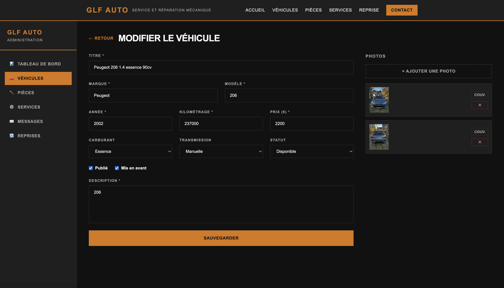

# GLF Auto — Frontend

Interface web de [GLF Auto](https://glf-auto.vercel.app/), plateforme développée pour un garage automobile permettant de présenter et vendre des véhicules et pièces d'occasion en ligne. Le site est **déployé en production** et utilisé par un client réel.

Ce dépôt contient la partie frontend ; la partie API se trouve dans le dépôt [GLF-auto](https://github.com/sangoaz/GLF-auto) (FastAPI / PostgreSQL).

## Aperçu

- **Site en ligne** : [glf-auto.vercel.app](https://glf-auto.vercel.app/)
- **Backend associé** : [github.com/sangoaz/GLF-auto](https://github.com/sangoaz/GLF-auto)

<p align="center">
  
</p>

<p align="center">
  
</p>

<p align="center">
  
</p>
## Fonctionnalités

Le site public présente :

- Page d'accueil avec présentation du garage et de ses points forts
- Catalogue des véhicules d'occasion disponibles
- Catalogue des pièces d'occasion disponibles
- Présentation des services proposés (entretien, réparation...)
- Formulaire de demande de reprise de véhicule
- Page de contact avec coordonnées du garage (adresse, téléphone, horaires)
- Espace d'administration protégé (`/admin`) permettant au gérant de gérer le catalogue (véhicules, pièces, services) et de consulter les demandes reçues

L'ensemble du contenu (véhicules, pièces, services) est géré dynamiquement via l'API backend. La mise à jour du catalogue se fait depuis l'espace d'administration (`/admin`), inclus dans ce même dépôt et protégé par authentification.

## Stack technique

- **Framework** : Next.js 16 (React 19)
- **Style** : Tailwind CSS 4
- **Déploiement** : Vercel (déploiement automatique à chaque push sur la branche principale)
- **Sécurité** : middleware Next.js pour la protection des routes d'administration
- **Données** : consommées depuis l'API backend FastAPI ([GLF-auto](https://github.com/sangoaz/GLF-auto))

## Structure du projet

```
src/
  app/
    admin/          # Espace d'administration (gestion véhicules, pièces, services...)
    api/             # Routes API internes Next.js (proxy/utilitaires)
    components/      # Composants réutilisables (UI)
    contact/         # Page de contact
    hooks/           # Hooks React personnalisés
    pieces/          # Catalogue des pièces d'occasion
    reprise/         # Formulaire de demande de reprise
    services/        # Présentation des services du garage
    utils/           # Fonctions utilitaires
    vehicules/       # Catalogue des véhicules d'occasion
    layout.js        # Layout global de l'application
    page.js          # Page d'accueil
    globals.css      # Styles globaux
  middleware.js      # Middleware Next.js (ex. protection des routes admin)
public/              # Assets statiques
```

## Installation et lancement en local

### Prérequis

- Node.js 18+
- Le backend GLF Auto lancé en local ou accessible (voir [GLF-auto](https://github.com/sangoaz/GLF-auto))

### Étapes

1. **Cloner le dépôt**

   ```bash
   git clone <url-du-repo>
   cd GLF-auto-Frontend
   ```

2. **Installer les dépendances**

   ```bash
   npm install
   ```

3. **Configurer les variables d'environnement**

   Créer un fichier `.env.local` avec l'URL de l'API backend :

   ```
   NEXT_PUBLIC_API_URL=http://localhost:8000
   ```

   En production, cette variable pointe vers le backend déployé sur Render (`https://glf-auto.onrender.com`).

4. **Lancer le serveur de développement**

   ```bash
   npm run dev
   ```

   Le site est accessible sur `http://localhost:3000`.

## Déploiement

Le site est déployé sur Vercel, connecté directement au dépôt GitHub : chaque mise à jour sur la branche principale est automatiquement publiée. Le backend (API + base de données) est hébergé séparément (Render + Supabase, voir le dépôt backend).

## Pistes d'évolution

- Ajout de filtres de recherche avancés sur le catalogue (prix, kilométrage, modèle)
- Optimisation des images (formats modernes, lazy loading avancé)
- Amélioration du référencement (SEO) pour le site public

---

**Auteur** : Kévin Fruchon (sangoaz)
**Licence** : MIT
